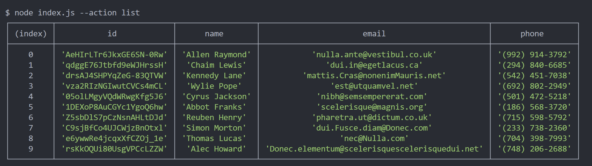
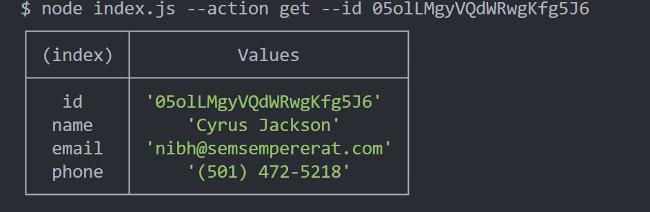
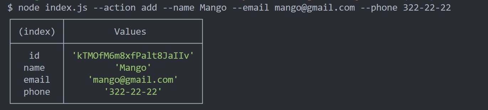
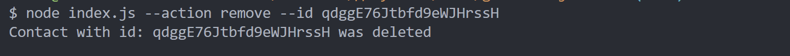

# goit-nodejs-hw-01

HW NodeJs #01

node index.js --action list

node index.js --action get --id 05olLMgyVQdWRwgKfg5J6

node index.js --action add --name Mango --email mango@gmail.com --phone 322-22-22

node index.js --action remove --id qdggE76Jtbfd9eWJHrssH

